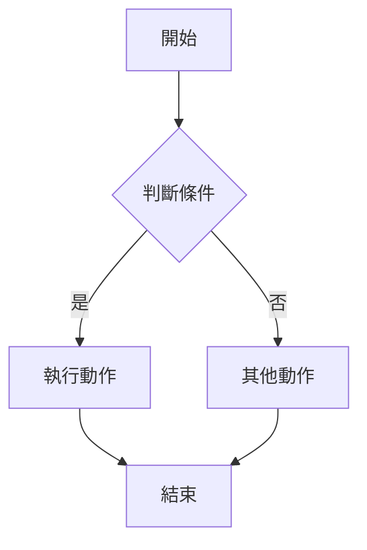
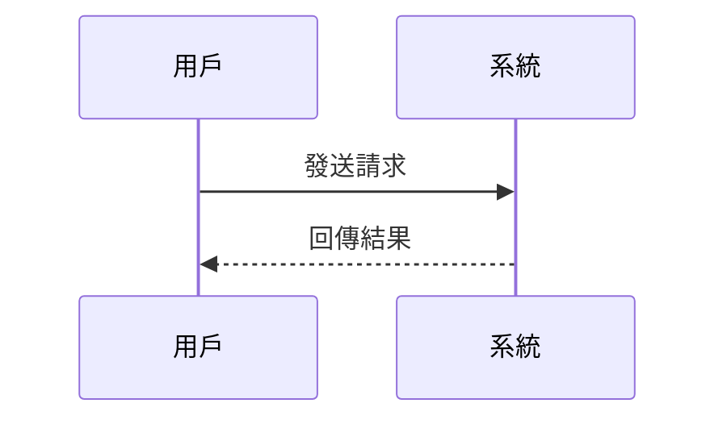
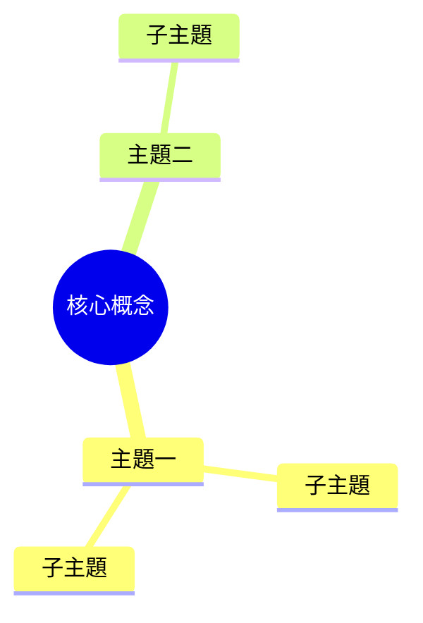
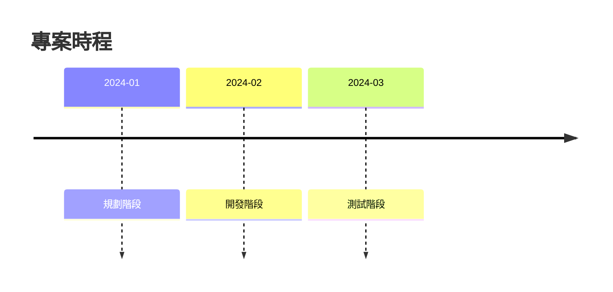
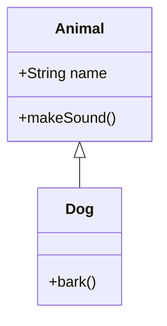

# enhance-mermaid

掃描 Markdown 檔案，將適合以圖表呈現的內容轉換為 Mermaid 圖表。

## 用途

- 將文字描述的流程轉為流程圖
- 將概念層級轉為心智圖
- 將互動流程轉為序列圖
- 增加內容的視覺化呈現

## 使用方式

```bash
# 產生 prompt
./gradlew generatePrompt -Ptype=enhance-mermaid

# 儲存到檔案
./gradlew generatePrompt -Ptype=enhance-mermaid -Poutput=PROMPT.md
```

## 完整 Prompt

以下是完整的 Prompt 內容，可直接複製使用：

---

````markdown
# 任務：Markdown Mermaid 圖表增強

## 目標
掃描 Hugo Book 專案中的 Markdown 檔案，將適合以圖表呈現的內容轉換為 Mermaid 圖表。

## Mermaid 語法說明

### 流程圖 (Flowchart)
```markdown

```

### 序列圖 (Sequence Diagram)
```markdown

```

### 心智圖 (Mind Map)
```markdown

```

### 時間軸 (Timeline)
```markdown

```

### 類別圖 (Class Diagram)
```markdown

```

## 執行步驟

1. **掃描檔案**
   - 找到 `site/content/` 下所有 `.md` 檔案
   - 識別適合轉換為圖表的內容：
     - 流程描述
     - 步驟說明
     - 層級結構
     - 關係說明

2. **識別適合圖表化的內容**
   - 條列式的步驟流程 → 流程圖
   - 對話或互動流程 → 序列圖
   - 概念層級結構 → 心智圖
   - 時間線敘述 → 時間軸
   - 物件關係 → 類別圖

3. **轉換建議**
   - 保留原始文字描述
   - 在描述下方加入 Mermaid 圖表
   - 使用繁體中文標籤

## Hugo 設定確認

Hugo Book 主題通常已內建 Mermaid 支援。確認 `site/hugo.toml`：
```toml
[params]
  BookToC = true
```

如需手動啟用，在 `site/layouts/partials/docs/inject/footer.html` 加入：
```html
<script type="module">
  import mermaid from 'https://cdn.jsdelivr.net/npm/mermaid@10/dist/mermaid.esm.min.mjs';
  mermaid.initialize({ startOnLoad: true });
</script>
```

## 開始執行

請先掃描專案，列出可以圖表化的內容段落，讓我確認要轉換哪些後再執行。
````

---

## 適合圖表化的內容

| 內容類型 | 建議圖表 |
|----------|----------|
| 步驟流程 | 流程圖 (flowchart) |
| 對話互動 | 序列圖 (sequenceDiagram) |
| 概念層級 | 心智圖 (mindmap) |
| 時間線 | 時間軸 (timeline) |
| 物件關係 | 類別圖 (classDiagram) |

## 相關指令

- [generate-prompt]() - 產生此 prompt
